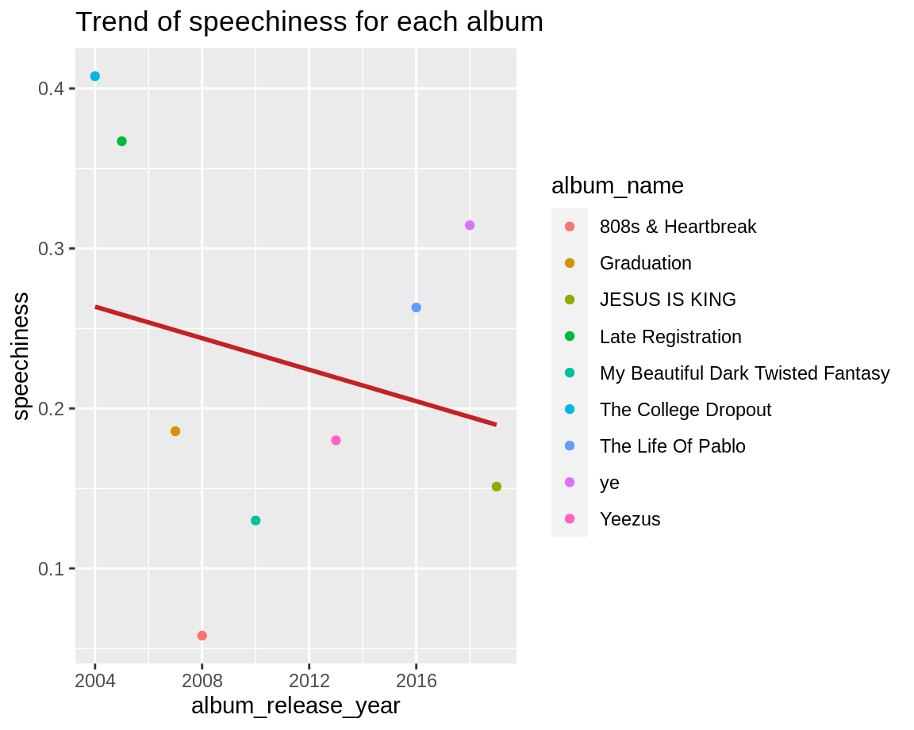

<style>
.chart-stage-flex{
  min-height: 600px;
}

body {
  padding-top: 70px;
  font-family:"Roboto","Helvetica Neue",Helvetica,Arial,sans-serif;
  line-height:1.42857143;}
}

.section.sidebar {
  top: 61px;
}

.storyboard-nav .sbframelist ul li.active {
  border-left: 3px solid #1db954;
}


.navbar-inverse .navbar-nav>li>a:hover, .navbar-inverse .navbar-nav>li>a:focus {
    color: #d9d9d9;
    background-color: #7d7d7d;
}


.nav-tabs-custom > .nav-tabs > li > a {
  border-top-color: white;
  border-right-color: white;
  border-left-color: white;
}

.nav-tabs-custom > .nav-tabs > li.active {
  border-top-color: rgba(50, 93, 136, 0.7);
}


.navbar-inverse{
  background-color:#121212;
  border-color:#080808
}

</style>


### The Corpus: The emotional rollecoaster that represents the life of Kanye West and the type of music he created. {data-commentary-width=650}


</img>


***

<b>The Corpus</b> <br>
For this course the well known Hip Hop artist Kanye West has been chosen. Beside being active in the music industry, he also works as a fashion designer and a politician. 

He started producing music for mainstream artist to promote his own rapping career. In 2004 he released his first album 'The College Dropout' which jump started his career. Kanye West had a lot of controversial media attention and is known for having manic moments. The sales of his albums have declined since his first album. This Corpus focuses on each album, and tries to find a correlation between the features of the songs and the decline in sales of his albums. We will analyze several periods of his career. 

<b>The College Dropout and Late Registration: 2003-2006</b> <br>
The first album Kanye West produced was called The College Dropout. This album acclaimed triple platinum and was a successful start for Kanye. Just before the second album Late Registration was released he had his first big controversy. At the Concert for Hurricane Relief he called out George Bush by saying that he doesn't care about black people. Also he stormed out the awards because he lost the award for Best New Artist to Gretchen Wilson. This is were you first see that Kanye has struggles with his mental state and that he has manic episodes. Because he sold so many albums, Kanye decided to create a record label called GOOD Music. These first two albums were high in energy and overall happy compared to his later albums. We hope to see some effect from this later on.

<b>Graduation and, 808s and Heartbreak: 2007-2009</b> <br>
In these albums he started to work with electronic music from the eighties. Also his chord progression was inspired by The Rolling Stones. He also started working with big artist like Daft Punk and Kid Cudi. This is were his creative talent in producing was coming to fruition, and his productions were more unique than other Hip Hop artists at the time. After Graduation Kanye had a lot of problems in life which affected the way he makes music. This is something we expect to see in analysing his music around this period.

<b>My Beautiful Dark Twisted Fantasy and Yeezus: 2010-2015</b> <br>
During this period he wanted to focus more on his fashion brand and his family. Everything what happened before really affected him and he wasn't producing as much as he was doing before. Also he had his first child which ofcourse would affect someone in different ways. 

<b>The life of Pablo, Ye and Jesus Is King: 2016-present</b> 
The end of the road. During this peroid he was cancelling tours, having psychologial issues and was even hospitalized because of this. And recently his wife devorced him because of the fact that he is bipolar. Meaning he could go from depressed to manic from time to time making him very unstable.

We would like to see if there can be found any links between his personal life and the way he produces and writes songs. Because he does both things, there could be a strong correlation. 

<div class="knitr-options" data-fig-width="576" data-fig-height="460"></div>


### API features from 2003 to 2019 {data-commentary-width=450}


<div class="knitr-options" data-fig-width="576" data-fig-height="460"></div>

```{=html}
<div id="htmlwidget-bc716eaea8a06effb7a9" style="width:576px;height:460.8px;" class="plotly html-widget"></div>
<script type="application/json" data-for="htmlwidget-bc716eaea8a06effb7a9">{"x":{"data":[{"x":[2,1],"y":[0.592666666666667,0.566454545454545],"text":["<b>Danceability<\/b><br />Value: 0.592666666666667 <br />SD: 0.124954951232028","<b>Danceability<\/b><br />Value: 0.566454545454545 <br />SD: 0.17776240526971"],"type":"scatter","mode":"markers","marker":{"autocolorscale":false,"color":"rgba(0,255,0,1)","opacity":0.55,"size":[16.4026583292744,18.8356217421132],"symbol":"circle","line":{"width":1.88976377952756,"color":"rgba(0,255,0,1)"}},"hoveron":"points","showlegend":false,"xaxis":"x","yaxis":"y","hoverinfo":"text","frame":null},{"x":[1,2],"y":[0.566454545454545,0.592666666666667],"text":"","type":"scatter","mode":"lines","line":{"width":1.88976377952756,"color":"rgba(0,255,0,0.55)","dash":"solid"},"hoveron":"points","showlegend":false,"xaxis":"x","yaxis":"y","hoverinfo":"text","frame":null},{"x":[0.7,0.7],"y":[0.592666666666667,0.592666666666667],"text":["Danceability","Danceability"],"hovertext":["",""],"textfont":{"size":14.6645669291339,"color":"rgba(0,255,0,1)"},"type":"scatter","mode":"text","hoveron":"points","showlegend":false,"xaxis":"x","yaxis":"y","hoverinfo":"text","frame":null},{"x":[1,1,null,1,1],"y":[0,1,null,0,1],"text":"","type":"scatter","mode":"lines","line":{"width":75.5905511811024,"color":"rgba(255,0,0,0.05)","dash":"solid"},"hoveron":"points","showlegend":false,"xaxis":"x","yaxis":"y","hoverinfo":"text","frame":null},{"x":[2,2,null,2,2],"y":[0,1,null,0,1],"text":"","type":"scatter","mode":"lines","line":{"width":75.5905511811024,"color":"rgba(0,0,255,0.05)","dash":"solid"},"hoveron":"points","showlegend":false,"xaxis":"x","yaxis":"y","hoverinfo":"text","frame":null},{"x":[2,1],"y":[0.590547619047619,0.539454545454545],"text":["<b>Energy<\/b><br />Value: 0.590547619047619 <br />SD: 0.220022194266402","<b>Energy<\/b><br />Value: 0.539454545454545 <br />SD: 0.240799237389309"],"type":"scatter","mode":"markers","marker":{"autocolorscale":false,"color":"rgba(0,0,0,1)","opacity":0.55,"size":[20.529979391784,21.3030402279416],"symbol":"circle","line":{"width":1.88976377952756,"color":"rgba(0,0,0,1)"}},"hoveron":"points","showlegend":false,"xaxis":"x","yaxis":"y","hoverinfo":"text","frame":null},{"x":[1,2],"y":[0.539454545454545,0.590547619047619],"text":"","type":"scatter","mode":"lines","line":{"width":1.88976377952756,"color":"rgba(0,0,0,0.55)","dash":"solid"},"hoveron":"points","showlegend":false,"xaxis":"x","yaxis":"y","hoverinfo":"text","frame":null},{"x":[0.7,0.7],"y":[0.590547619047619,0.590547619047619],"text":["Energy","Energy"],"hovertext":["",""],"textfont":{"size":14.6645669291339,"color":"rgba(0,0,0,1)"},"type":"scatter","mode":"text","hoveron":"points","showlegend":false,"xaxis":"x","yaxis":"y","hoverinfo":"text","frame":null},{"x":[2,1],"y":[0.407716666666667,0.151118181818182],"text":["<b>Speechiness<\/b><br />Value: 0.407716666666667 <br />SD: 0.277711311693054","<b>Speechiness<\/b><br />Value: 0.151118181818182 <br />SD: 0.170226829954516"],"type":"scatter","mode":"markers","marker":{"autocolorscale":false,"color":"rgba(0,0,255,1)","opacity":0.55,"size":[22.5982816163653,18.5130353916491],"symbol":"circle","line":{"width":1.88976377952756,"color":"rgba(0,0,255,1)"}},"hoveron":"points","showlegend":false,"xaxis":"x","yaxis":"y","hoverinfo":"text","frame":null},{"x":[1,2],"y":[0.151118181818182,0.407716666666667],"text":"","type":"scatter","mode":"lines","line":{"width":1.88976377952756,"color":"rgba(0,0,255,0.55)","dash":"solid"},"hoveron":"points","showlegend":false,"xaxis":"x","yaxis":"y","hoverinfo":"text","frame":null},{"x":[0.7,0.7],"y":[0.407716666666667,0.407716666666667],"text":["Speechiness","Speechiness"],"hovertext":["",""],"textfont":{"size":14.6645669291339,"color":"rgba(0,0,255,1)"},"type":"scatter","mode":"text","hoveron":"points","showlegend":false,"xaxis":"x","yaxis":"y","hoverinfo":"text","frame":null},{"x":[2,1],"y":[0.359087857142857,0.479577090909091],"text":["<b>Acousticness<\/b><br />Value: 0.359087857142857 <br />SD: 0.262255453518462","<b>Acousticness<\/b><br />Value: 0.479577090909091 <br />SD: 0.280044357938329"],"type":"scatter","mode":"markers","marker":{"autocolorscale":false,"color":"rgba(255,192,203,1)","opacity":0.55,"size":[22.0671044673733,22.6771653543307],"symbol":"circle","line":{"width":1.88976377952756,"color":"rgba(255,192,203,1)"}},"hoveron":"points","showlegend":false,"xaxis":"x","yaxis":"y","hoverinfo":"text","frame":null},{"x":[1,2],"y":[0.479577090909091,0.359087857142857],"text":"","type":"scatter","mode":"lines","line":{"width":1.88976377952756,"color":"rgba(255,192,203,0.55)","dash":"solid"},"hoveron":"points","showlegend":false,"xaxis":"x","yaxis":"y","hoverinfo":"text","frame":null},{"x":[0.7,0.7],"y":[0.359087857142857,0.359087857142857],"text":["Acousticness","Acousticness"],"hovertext":["",""],"textfont":{"size":14.6645669291339,"color":"rgba(255,192,203,1)"},"type":"scatter","mode":"text","hoveron":"points","showlegend":false,"xaxis":"x","yaxis":"y","hoverinfo":"text","frame":null},{"x":[2,1],"y":[1.15738095238095e-06,0.000223036363636364],"text":["<b>Instrumentalness<\/b><br />Value: 1.15738095238095e-06 <br />SD: 3.90723410344716e-06","<b>Instrumentalness<\/b><br />Value: 0.000223036363636364 <br />SD: 0.000329614939809249"],"type":"scatter","mode":"markers","marker":{"autocolorscale":false,"color":"rgba(255,165,0,1)","opacity":0.55,"size":[3.77952755905512,4.42401009506625],"symbol":"circle","line":{"width":1.88976377952756,"color":"rgba(255,165,0,1)"}},"hoveron":"points","showlegend":false,"xaxis":"x","yaxis":"y","hoverinfo":"text","frame":null},{"x":[1,2],"y":[0.000223036363636364,1.15738095238095e-06],"text":"","type":"scatter","mode":"lines","line":{"width":1.88976377952756,"color":"rgba(255,165,0,0.55)","dash":"solid"},"hoveron":"points","showlegend":false,"xaxis":"x","yaxis":"y","hoverinfo":"text","frame":null},{"x":[0.7,0.7],"y":[1.15738095238095e-06,1.15738095238095e-06],"text":["Instrumentalness","Instrumentalness"],"hovertext":["",""],"textfont":{"size":14.6645669291339,"color":"rgba(255,165,0,1)"},"type":"scatter","mode":"text","hoveron":"points","showlegend":false,"xaxis":"x","yaxis":"y","hoverinfo":"text","frame":null},{"x":[2,1],"y":[0.316740476190476,0.301054545454545],"text":["<b>Liveness<\/b><br />Value: 0.316740476190476 <br />SD: 0.155611867155971","<b>Liveness<\/b><br />Value: 0.301054545454545 <br />SD: 0.251779968876145"],"type":"scatter","mode":"markers","marker":{"autocolorscale":false,"color":"rgba(160,32,240,1)","opacity":0.55,"size":[17.8663500245928,21.6981391110444],"symbol":"circle","line":{"width":1.88976377952756,"color":"rgba(160,32,240,1)"}},"hoveron":"points","showlegend":false,"xaxis":"x","yaxis":"y","hoverinfo":"text","frame":null},{"x":[1,2],"y":[0.301054545454545,0.316740476190476],"text":"","type":"scatter","mode":"lines","line":{"width":1.88976377952756,"color":"rgba(160,32,240,0.55)","dash":"solid"},"hoveron":"points","showlegend":false,"xaxis":"x","yaxis":"y","hoverinfo":"text","frame":null},{"x":[0.7,0.7],"y":[0.316740476190476,0.316740476190476],"text":["Liveness","Liveness"],"hovertext":["",""],"textfont":{"size":14.6645669291339,"color":"rgba(160,32,240,1)"},"type":"scatter","mode":"text","hoveron":"points","showlegend":false,"xaxis":"x","yaxis":"y","hoverinfo":"text","frame":null},{"x":[2,1],"y":[0.663047619047619,0.380727272727273],"text":["<b>Valence<\/b><br />Value: 0.663047619047619 <br />SD: 0.12963173963587","<b>Valence<\/b><br />Value: 0.380727272727273 <br />SD: 0.166648186854277"],"type":"scatter","mode":"markers","marker":{"autocolorscale":false,"color":"rgba(255,0,0,1)","opacity":0.55,"size":[16.6367236109179,18.3573394512395],"symbol":"circle","line":{"width":1.88976377952756,"color":"rgba(255,0,0,1)"}},"hoveron":"points","showlegend":false,"xaxis":"x","yaxis":"y","hoverinfo":"text","frame":null},{"x":[1,2],"y":[0.380727272727273,0.663047619047619],"text":"","type":"scatter","mode":"lines","line":{"width":1.88976377952756,"color":"rgba(255,0,0,0.55)","dash":"solid"},"hoveron":"points","showlegend":false,"xaxis":"x","yaxis":"y","hoverinfo":"text","frame":null},{"x":[0.7,0.7],"y":[0.663047619047619,0.663047619047619],"text":["Valence","Valence"],"hovertext":["",""],"textfont":{"size":14.6645669291339,"color":"rgba(255,0,0,1)"},"type":"scatter","mode":"text","hoveron":"points","showlegend":false,"xaxis":"x","yaxis":"y","hoverinfo":"text","frame":null}],"layout":{"margin":{"t":25.1483025610482,"r":7.30593607305936,"b":24.4907683144729,"l":48.9497716894977},"plot_bgcolor":"rgba(255,255,255,1)","paper_bgcolor":"rgba(255,255,255,1)","font":{"color":"rgba(0,0,0,1)","family":"","size":14.6118721461187},"xaxis":{"domain":[0,1],"automargin":true,"type":"linear","autorange":false,"range":[0.4,2.6],"tickmode":"array","ticktext":["JESUS IS KING","The College Dropout"],"tickvals":[1,2],"categoryorder":"array","categoryarray":["JESUS IS KING","The College Dropout"],"nticks":null,"ticks":"outside","tickcolor":"rgba(179,179,179,1)","ticklen":3.65296803652968,"tickwidth":0.33208800332088,"showticklabels":true,"tickfont":{"color":"rgba(77,77,77,1)","family":"","size":11.689497716895},"tickangle":-0,"showline":false,"linecolor":null,"linewidth":0,"showgrid":true,"gridcolor":"rgba(222,222,222,1)","gridwidth":0.33208800332088,"zeroline":false,"anchor":"y","title":{"text":"","font":{"color":"rgba(0,0,0,1)","family":"","size":14.6118721461187}},"hoverformat":".2f"},"yaxis":{"domain":[0,1],"automargin":true,"type":"linear","autorange":false,"range":[-0.05,1.05],"tickmode":"array","ticktext":["0.00","0.25","0.50","0.75","1.00"],"tickvals":[0,0.25,0.5,0.75,1],"categoryorder":"array","categoryarray":["0.00","0.25","0.50","0.75","1.00"],"nticks":null,"ticks":"outside","tickcolor":"rgba(179,179,179,1)","ticklen":3.65296803652968,"tickwidth":0.33208800332088,"showticklabels":true,"tickfont":{"color":"rgba(77,77,77,1)","family":"","size":11.689497716895},"tickangle":-0,"showline":false,"linecolor":null,"linewidth":0,"showgrid":true,"gridcolor":"rgba(222,222,222,1)","gridwidth":0.33208800332088,"zeroline":false,"anchor":"x","title":{"text":"Value","font":{"color":"rgba(0,0,0,1)","family":"","size":14.6118721461187}},"hoverformat":".2f"},"shapes":[{"type":"rect","fillcolor":"transparent","line":{"color":"rgba(179,179,179,1)","width":0.66417600664176,"linetype":"solid"},"yref":"paper","xref":"paper","x0":0,"x1":1,"y0":0,"y1":1}],"showlegend":false,"legend":{"bgcolor":"rgba(255,255,255,1)","bordercolor":"transparent","borderwidth":1.88976377952756,"font":{"color":"rgba(0,0,0,1)","family":"","size":11.689497716895}},"hovermode":"closest","barmode":"relative"},"config":{"doubleClick":"reset","showSendToCloud":false},"source":"A","attrs":{"2ff73bd9346a":{"x":{},"y":{},"size":{},"text":{},"alpha":{},"type":"scatter"},"2ff745ae12b3":{"x":{},"y":{},"alpha":{}},"2ff72c743f3a":{"x":{},"y":{},"label":{}},"2ff72311a49e":{"x":{},"y":{},"xend":{},"yend":{}},"2ff77d00cdcc":{"x":{},"y":{},"xend":{},"yend":{}},"2ff7255bac12":{"x":{},"y":{},"size":{},"text":{},"alpha":{}},"2ff775460b70":{"x":{},"y":{},"alpha":{}},"2ff74688d314":{"x":{},"y":{},"label":{}},"2ff7531606b2":{"x":{},"y":{},"size":{},"text":{},"alpha":{}},"2ff75ffa9349":{"x":{},"y":{},"alpha":{}},"2ff7240c7410":{"x":{},"y":{},"label":{}},"2ff76e490161":{"x":{},"y":{},"size":{},"text":{},"alpha":{}},"2ff779ce6cd5":{"x":{},"y":{},"alpha":{}},"2ff7209229f8":{"x":{},"y":{},"label":{}},"2ff7752415fa":{"x":{},"y":{},"size":{},"text":{},"alpha":{}},"2ff777e05ccb":{"x":{},"y":{},"alpha":{}},"2ff767f8ba4d":{"x":{},"y":{},"label":{}},"2ff7627d36f4":{"x":{},"y":{},"size":{},"text":{},"alpha":{}},"2ff7193ec8e0":{"x":{},"y":{},"alpha":{}},"2ff774dc5b90":{"x":{},"y":{},"label":{}},"2ff727229e0f":{"x":{},"y":{},"size":{},"text":{},"alpha":{}},"2ff71a3a171d":{"x":{},"y":{},"alpha":{}},"2ff7827eb01":{"x":{},"y":{},"label":{}}},"cur_data":"2ff73bd9346a","visdat":{"2ff73bd9346a":["function (y) ","x"],"2ff745ae12b3":["function (y) ","x"],"2ff72c743f3a":["function (y) ","x"],"2ff72311a49e":["function (y) ","x"],"2ff77d00cdcc":["function (y) ","x"],"2ff7255bac12":["function (y) ","x"],"2ff775460b70":["function (y) ","x"],"2ff74688d314":["function (y) ","x"],"2ff7531606b2":["function (y) ","x"],"2ff75ffa9349":["function (y) ","x"],"2ff7240c7410":["function (y) ","x"],"2ff76e490161":["function (y) ","x"],"2ff779ce6cd5":["function (y) ","x"],"2ff7209229f8":["function (y) ","x"],"2ff7752415fa":["function (y) ","x"],"2ff777e05ccb":["function (y) ","x"],"2ff767f8ba4d":["function (y) ","x"],"2ff7627d36f4":["function (y) ","x"],"2ff7193ec8e0":["function (y) ","x"],"2ff774dc5b90":["function (y) ","x"],"2ff727229e0f":["function (y) ","x"],"2ff71a3a171d":["function (y) ","x"],"2ff7827eb01":["function (y) ","x"]},"highlight":{"on":"plotly_click","persistent":false,"dynamic":false,"selectize":false,"opacityDim":0.2,"selected":{"opacity":1},"debounce":0},"shinyEvents":["plotly_hover","plotly_click","plotly_selected","plotly_relayout","plotly_brushed","plotly_brushing","plotly_clickannotation","plotly_doubleclick","plotly_deselect","plotly_afterplot","plotly_sunburstclick"],"base_url":"https://plot.ly"},"evals":[],"jsHooks":[]}</script>
```

<div class="knitr-options" data-fig-width="576" data-fig-height="460"></div>


***

<b>The features from the Spotify API</b> <br>
To understand what key differences were between Kanye West's early work and his latest work we decided to extract different spotify API features and see if there were any features that stood out. We checked several featuers for the two albums, The College Dropout and Jesus is King. Valence, Energy, Dancibility, Speechiness, Acousticness, Liveness and Instrumentalness. Two interesting trends can be seen in the figure on the left. We see a drastic change in both Valence and Speechiness. 

<b>Valence</b> <br>
The feature <span style='color:red'>Valence</span>, which describes how positive a song is, almost halves during his career. This would mean that his songs started becoming less happy and more angry or sad. We will try to see if there is any way we can correlate between the chords of a song and how happy or sad it is.  

<b>Speechiness</b> <br>
The feature <span style='color:blue'>Speechiness</span> says something about how many spoken words are found in a track. We see a large difference between Kanye's first album and his last album, suggesting that his first focust more on rap. Since the last album falls under the value of 0.33, Spotify thinks this album is non-speech like music.


<div class="knitr-options" data-fig-width="576" data-fig-height="460"></div>


### Analyzing the loss in valence of each album{data-commentary-width=350}

<div class="knitr-options" data-fig-width="576" data-fig-height="460"></div>

<div class="knitr-options" data-fig-width="576" data-fig-height="460"></div>


***

<b>Valence by album from 2003 to 2019</b> <br>
Kanye west produced 9 albums during his career. We used the Spotify API to extract the valence of each track in each album. Valence is a term used in psychology to describe the emotion of a specific event. Here a low valence is correlated to averseness and positive to goodness. The spotify API uses this feature to describe if a song has a negative emotion like fear and anger, or a positive emotion like joy and happiness. 

From the first album The College Dropout (2003) to Jesus is King (2019) we see a decline in the valence. We suspect that this decline in valence correlates with the decline of the sales of his album, but also his personal life. Were Kanye enjoyed his first years as a pop star, right after Graduation he experienced a lot of distress in his life. It looks like he never really recovered from these events.

<b>808s & Heartbreak</b> <br>
This album was created during a period where Kanye experienced a lot of distressing events. The album was coined as the first emo rap genre, where the songs were mostly about heartbreak and sadness. You can see this clearly in the low value of valence. These events happen right after Graduation, which had relative high valence.


<div class="knitr-options" data-fig-width="576" data-fig-height="460"></div>


### Analyzing the loss in speechiness of each album{data-commentary-width=350}

<div class="knitr-options" data-fig-width="576" data-fig-height="460"></div>


<div class="knitr-options" data-fig-width="576" data-fig-height="460"></div>


***

<b>Speechiness by album from 2003 to 2019</b> <br>
When we analyse the evolution of speechiness from 2003 to 2019 we see that while it does have a downward trend, it seems to change drastically every album. We see some sort of sinus wave where it starts out very high, goes down fast and then rises a little. The literature states that Kanye started experimenting more with music productions after the second album. This could be the reason that speechiness drops, cause more of his energy is put into creating the actual track instead of the lyrics.


<div class="knitr-options" data-fig-width="576" data-fig-height="460"></div>


### Self Similarity Matrices {data-commentary-width=300}

<div class="knitr-options" data-fig-width="576" data-fig-height="460"></div>


***

<b>SSM Matrix</b> <br>
So we used the data we collected on speechiness and valence, and looked for a track with the most disparity between them. It could be interesting if we see a difference in their self similarity matrices if there is a big difference between the two features. For the first track we used Breath in Breath out and the second is God is. 

<b>SSM: Breath in Breath out</b> <br>
This one is hard to interpet, you see some diagonal lines. But there aren't any clear blocks like the song God is. 

<b>SSM: God is</b> <br>
This track has a pretty nice SMM matrix. We clearly see a homogeneity block in the center and some repetition blocks. Also we can see some novelt blocks, not as clearly as the other two. 


<div class="knitr-options" data-fig-width="576" data-fig-height="460"></div>


### Chordogram: Kanye vs The Stones {data-commentary-width=300}

<div class="knitr-options" data-fig-width="576" data-fig-height="460"></div>


***

<b>Chordogram between Kanye West and The Rolling Stones</b> <br>
The literature about Kanye's career said that he got inspired by The Rolling Stones and started using their chord progressions. So this was a perfect time to test the chordogram. There were a couple of songs that showed similarity, but we chose Paint it Black and Can't Tell me Nothing. We see that both tracks are predominantly in either B major or Bb major. We see with both clear horizontal lines, were Paint it Black has a little more variation. Around 90 seconds there is a short break/bridge which changes to the chord Db major. 

<b>Kanye Chordograms versus his other tracks in the album Graduation</b> <br>
We have seen other tracks of Kanye, depsite not showing it here, we have seen a lot of resemblance in the horizontal lines. We think that this album focuses more on the lyrics. So the music was set more on the background. With the feature speechiness we see that this album has a low speechiness value, although in relation to the music this isn't that clear.

<div class="knitr-options" data-fig-width="576" data-fig-height="460"></div>


### Chromogram: The difference between sad and happy songs

<div class="knitr-options" data-fig-width="576" data-fig-height="460"></div>


***

<b>Power and Waves</b> <br>
We checked two songs, Power and Waves. Power is a song where he sings raps as if he is on his peak. The title of the song says it all. In contrast to waves, is seen as a very sad and conflicting song.</b> <br>

<b>Important Positive Valence Chords</b> <br>
G-Major     -> Serious, Magnificent, Fantasy
C           -> Innocently Happy

<b>Important Negative Valence Chords</b> <br>
F-Minor     -> Obscure, Plaintive, Funereal
D-Minor     -> Deep Distress, Existential Angst
C# Minor    -> Despair, Wailing, Weeping

<b>Power: Happy</b> <br>
So we see some chords that are discribed above, that represent his powerful track. The song is also about how he is in this fantasy where he is the star. He feels happy and strong, but also knows it's some sort of illusion. It is nice to see that in the chromogram

<b>Waves: Sad</b> <br>
We see in the chromogram that the chords F, Bb, Db and C are mostly used. These are chords that are mostly present in sad songs, like Rolling in the Deep from Adele. The song is from his last period, were the valence is the lowest. Also if we follow the news things didn't go well with his marriage because his wife couldn't handel Kanye's struggle with his emotions. 

### Conclusion

In conclusion, we can see that during Kanye's life a lot has happened and this had an effect on his productions. Especially during the events after Graduation, were his music totally changed from rather powerful and happy to sad and even emo. He did get his life back in track when he started writing My Beautiful and Dark fantasy, but it still had a lot of self doubt on what he actually was experiencing. Being bipolar can be hard to deal with expecially in your manic phases where you take to big of risks. We have seen a lot of controversies from him, but let's judge the work and not the artist.
